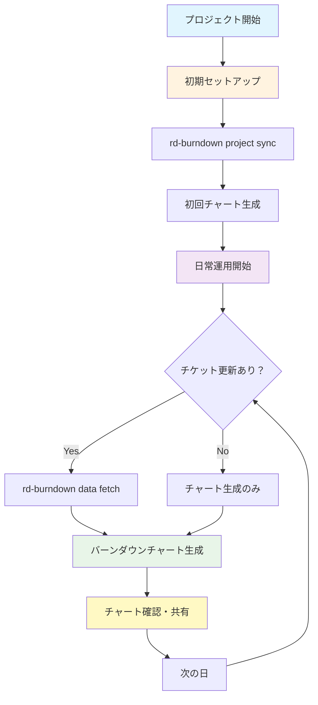
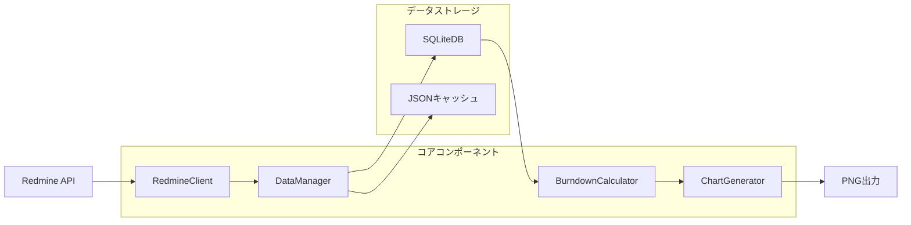

# rd-burndown

Redmine v4系で管理されたチケットの工数に対するバーンダウンチャートを作成するCLIツールです。

## 🎯 特徴

- **時系列データ対応**: チケット履歴から過去の日付における正確な残工数を計算
- **モダンなデザイン**: PNG画像による高品質なバーンダウンチャート
- **日本語完全対応**: 文字化けなしの日本語ラベル・タイトル表示
- **複数チャート種類**: 標準バーンダウン・スコープ変更・統合チャート
- **DevContainer対応**: 開発環境でのスムーズな動作

## 📋 要件

- Python 3.11+
- uv (パッケージマネージャー)
- Redmine v4系 (REST API有効)
- Docker & Docker Compose (開発環境用)

## 🚀 クイックスタート

### 1. 開発環境のセットアップ

```bash
# リポジトリクローン
git clone <repository-url>
cd rd-burndown

# 依存関係インストール
uv sync

# テスト環境起動（Redmine + テストデータ）
./scripts/setup_complete_test_environment.sh
```

### 2. 基本的な使用方法

```bash
# 環境変数設定
export RD_REDMINE_URL="http://localhost:3000"
export RD_REDMINE_API_KEY="your-api-key"

# プロジェクト同期
uv run rd-burndown project sync 1

# バーンダウンチャート生成
uv run rd-burndown chart burndown 1 --output burndown.png
```

## 📊 コマンド一覧

### プロジェクト管理

```bash
# プロジェクト一覧表示
uv run rd-burndown project list

# プロジェクト同期（初回・完全同期）
uv run rd-burndown project sync <project_id>

# プロジェクト情報表示
uv run rd-burndown project show <project_id>
```

### データ管理

```bash
# 増分データ更新（日常的な更新）
uv run rd-burndown data fetch <project_id>

# データエクスポート
uv run rd-burndown data export <project_id> --format json --output data.json

# キャッシュ管理
uv run rd-burndown data cache status --project-id <project_id>
uv run rd-burndown data cache clear --project-id <project_id>
```

### チャート生成

```bash
# 標準バーンダウンチャート
uv run rd-burndown chart burndown <project_id> --output chart.png

# スコープ変更チャート
uv run rd-burndown chart scope <project_id> --output scope.png

# 統合チャート
uv run rd-burndown chart combined <project_id> --output combined.png
```

## 🔄 日常的な運用ワークフロー



### 詳細なワークフロー手順

#### 🌅 **朝の作業** (5分)

```bash
# 前日からの変更を取得
uv run rd-burndown data fetch <project_id>

# 最新のバーンダウンチャート生成
uv run rd-burndown chart burndown <project_id> --output "burndown_$(date +%Y%m%d).png"
```

#### 📊 **定期レポート** (週次/月次)

```bash
# 複数チャートを一括生成
uv run rd-burndown chart burndown <project_id> --output burndown.png
uv run rd-burndown chart scope <project_id> --output scope.png
uv run rd-burndown chart combined <project_id> --output combined.png

# データバックアップ
uv run rd-burndown data export <project_id> --format json \
  --output "backup_$(date +%Y%m%d).json"
```

#### 🔧 **トラブルシューティング**

```bash
# データの整合性確認
uv run rd-burndown data cache status --project-id <project_id>

# 完全再同期（問題発生時）
uv run rd-burndown data cache clear --project-id <project_id>
uv run rd-burndown project sync <project_id>
```

## ⚙️ 設定

### 設定ファイル (`config.yaml`)

```yaml
redmine:
  url: "https://your-redmine.example.com"
  api_key: "your-api-key"
  timeout: 30
  verify_ssl: true

data:
  database_path: "data/burndown.db"
  cache_dir: "cache/"
  cache_ttl_hours: 24

chart:
  font_size: 8
  figure_size_width: 12
  figure_size_height: 8
  dpi: 150
```

### 環境変数

```bash
# Redmine接続設定
export RD_REDMINE_URL="https://redmine.example.com"
export RD_REDMINE_API_KEY="your-api-key"

# データベースパス
export RD_DATABASE_PATH="./data/burndown.db"

# キャッシュディレクトリ
export RD_CACHE_DIR="./cache/"
```

## 🏗️ アーキテクチャ

### データフロー



### 主要コンポーネント

- **RedmineClient**: Redmine REST API連携
- **DataManager**: データ同期・キャッシュ管理
- **BurndownCalculator**: バーンダウン計算ロジック
- **ChartGenerator**: matplotlib使用チャート生成

## 🧪 開発・テスト

### テスト環境

```bash
# Redmineテスト環境起動
./scripts/setup_complete_test_environment.sh

# テスト実行
uv run pytest

# 型チェック
uv run pyright

# コードフォーマット
uv run ruff format .
uv run ruff check . --fix
```

### テストデータ

テスト環境では以下のデータが自動作成されます：

- **プロジェクト**: テストプロジェクト (test-project)
- **期間**: 2025-08-10 〜 2025-08-17
- **チケット**: 8件 (計88時間)
- **履歴**: 13件のステータス変更履歴
- **バージョン**: v1.0.0, v1.1.0, v2.0.0

## 📈 出力例

### バーンダウンチャート

- **理想線**: プロジェクト開始から期限まで直線的に工数が減少
- **実線**: 実際の日次残工数の推移
- **Today線**: 現在日の表示
- **小さなフォント**: 見やすい文字サイズ
- **日付フォーマット**: yyyy-mm-dd形式

### データエクスポート

```json
{
  "project": {
    "id": 1,
    "name": "テストプロジェクト",
    "start_date": "2025-08-10",
    "end_date": "2025-08-20"
  },
  "snapshots": [
    {
      "date": "2025-08-10",
      "remaining_hours": 88.0,
      "completed_hours": 0.0
    },
    {
      "date": "2025-08-17",
      "remaining_hours": 70.0,
      "completed_hours": 18.0
    }
  ]
}
```

## 🤝 コントリビューション

1. フォークしてブランチ作成
2. 変更実装 (型ヒント必須)
3. テスト追加・実行
4. Pull Request作成

### コード品質

- **型ヒント**: 全ての関数に必須
- **docstring**: パブリックAPIに必須
- **行長**: 最大88文字
- **テスト**: 新機能・バグ修正に必須
- **コミット**: Conventional Commits形式（日本語）

## 📝 ライセンス

MIT License

## 🆘 サポート

- Issues: GitHub Issuesで報告
- ドキュメント: `doc/` ディレクトリ参照
- 設計詳細: `doc/design.md`

---

**開発環境での簡単テスト**:

```bash
./scripts/setup_complete_test_environment.sh
export RD_REDMINE_URL="http://172.17.0.1:3000"
export RD_REDMINE_API_KEY="048110ce3e4a78b218aede2826b01fbc90dff412"
uv run rd-burndown chart burndown 1 --output test.png
```
